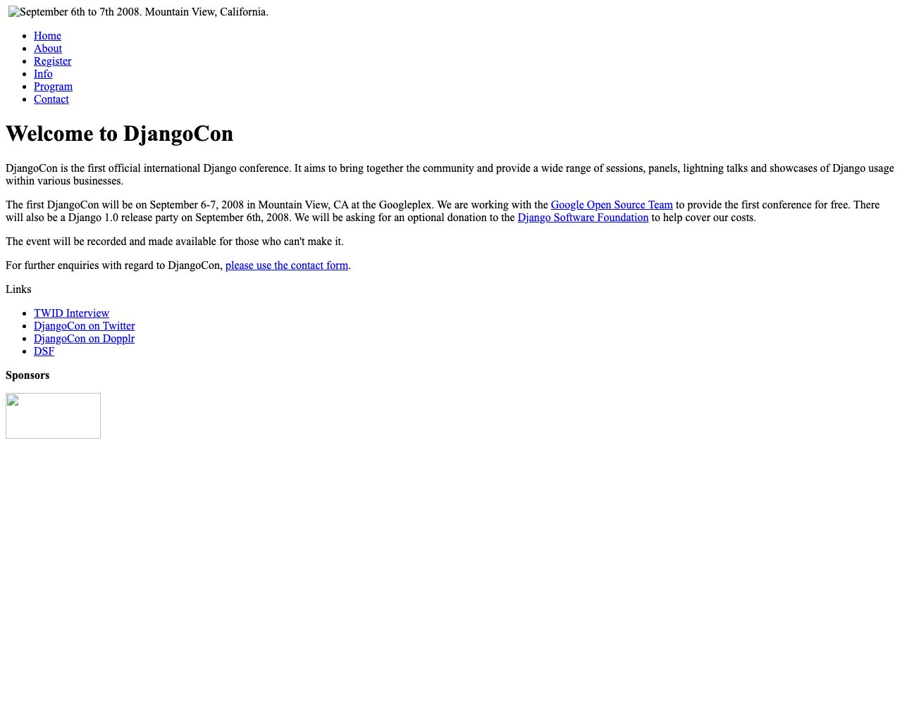
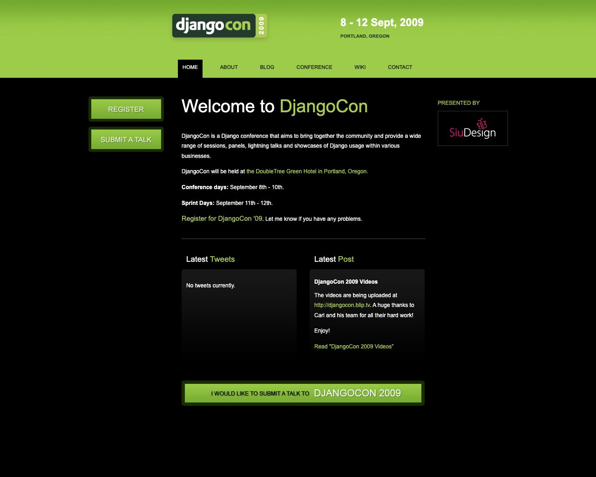
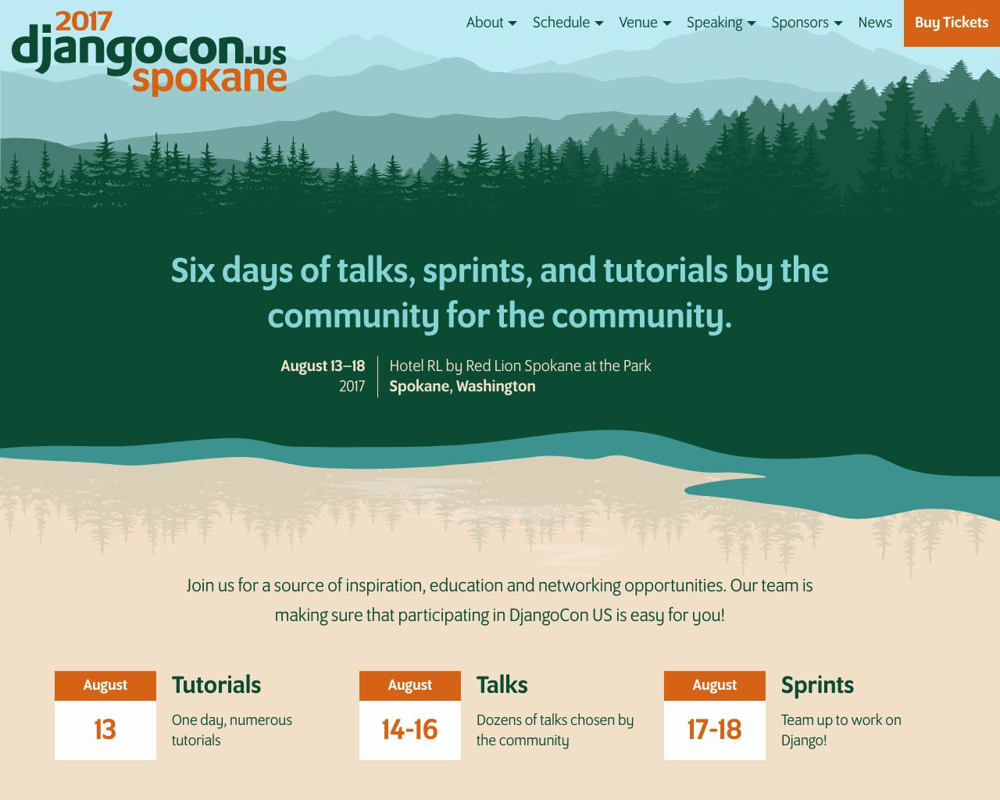
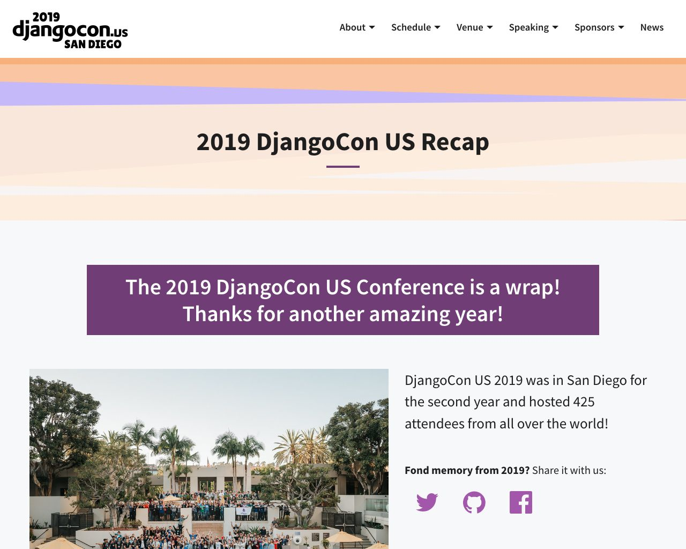

# DjangoCon Archive Project

The goal of this project is to archive past DjangoCon websites. 

Some of the websites are broken, and our only option of archiving them is to reconstruct a backup from the [Wayback Machine](https://archive.org/) :/ 

## Status

### Legend

| symbol             | description                                      |
| :----------------- | :----------------------------------------------- |
| :sos:              | An archive was not available.                    |
| :white_check_mark: | We are serving the website from a static version |
| :warning:          | Needs verified or has link issues.               |
| :wave:             | Needs a champion to help archive                 |
| :lock:             | Serves over SSL                                  |
| :unlock:           | Does not work over SSL                           |

The following websites were archived.

| year | country | backup status      | links                                                                                                                         | notes                     |
| :--: | :------ | :----------------- | ----------------------------------------------------------------------------------------------------------------------------- | ------------------------- |
| 2008 | US      | :sos:              | [:globe_with_meridians:](https://2008.djangocon.us)      [:octocat:](https://github.com/djangocon/2008.djangocon.us) :lock:   |                           |
| 2009 | US      | :warning:          | [:globe_with_meridians:](https://2009.djangocon.us)      [:octocat:](https://github.com/djangocon/2009.djangocon.us) :lock:   |                           |
| 2010 | Europe  | :sos:              | [:globe_with_meridians:](http://2010.djangocon.eu)                                                                            |                           |
| 2010 | US      | :warning:          | [:globe_with_meridians:](https://2010.djangocon.us)      [:octocat:](https://github.com/djangocon/2010.djangocon.us) :lock:   |                           |
| 2011 | Europe  | :wave:             | [:globe_with_meridians:](http://2011.djangocon.eu)                                                                            |                           |
| 2011 | US      | :warning:          | [:globe_with_meridians:](https://2011.djangocon.us)      [:octocat:](https://github.com/djangocon/2011.djangocon.us) :lock:   |                           |
| 2012 | Europe  | :wave:             | [:globe_with_meridians:](http://2012.djangocon.eu)                                                                            |                           |
| 2012 | US      | :sos:              | [:globe_with_meridians:](https://2012.djangocon.us)      [:octocat:](https://github.com/djangocon/2012.djangocon.us) :unlock: |                           |
| 2013 | Europe  | :wave:             | [:globe_with_meridians:](http://2013.djangocon.eu)       [:octocat:](https://github.com/djangocon/2013.djangocon.eu)          |                           |
| 2013 | US      | :warning:          | [:globe_with_meridians:](https://2013.djangocon.us)      [:octocat:](https://github.com/djangocon/2013.djangocon.us) :lock:   |                           |
| 2014 | Europe  | :wave:             | [:globe_with_meridians:](http://2014.djangocon.eu)                                                                            |                           |
| 2014 | US      | :warning:          | [:globe_with_meridians:](https://2014.djangocon.us)      [:octocat:](https://github.com/djangocon/2014.djangocon.us) :lock:   |                           |
| 2015 | Europe  | :wave:             | [:globe_with_meridians:](http://2015.djangocon.eu)       [:octocat:](https://github.com/djangocon/2015.djangocon.eu)          |                           |
| 2015 | US      | :warning:          | [:globe_with_meridians:](https://2015.djangocon.us)      [:octocat:](https://github.com/djangocon/2015.djangocon.us) :lock:   |                           |
| 2016 | Europe  | :wave:             | [:globe_with_meridians:](https://2016.djangocon.eu)      [:octocat:](https://github.com/djangocon/2016.djangocon.eu)          |                           |
| 2016 | US      | :warning:          | [:globe_with_meridians:](https://2016.djangocon.us)      [:octocat:](https://github.com/djangocon/2016.djangocon.us) :lock:   |                           |
| 2017 | AU      | :white_check_mark: | [:globe_with_meridians:](https://2017.djangocon.com.au)  [:octocat:](https://github.com/djangocon/2017.djangocon.com.au)      |                           |
| 2017 | Europe  | :wave:             | [:globe_with_meridians:](https://2017.djangocon.eu)      [:octocat:](https://github.com/djangocon/2017.djangocon.eu)          |                           |
| 2017 | US      | :white_check_mark: | [:globe_with_meridians:](https://2017.djangocon.us)      [:octocat:](https://github.com/djangocon/2017.djangocon.us) :lock:   | Designed for Github Pages |
| 2018 | AU      | :white_check_mark: | [:globe_with_meridians:](https://2018.djangocon.com.au)  [:octocat:](https://github.com/djangocon/2018.djangocon.com.au)      | Designed for Github Pages |
| 2018 | Europe  | :white_check_mark: | [:globe_with_meridians:](https://2018.djangocon.eu)      [:octocat:](https://github.com/djangocon/2018.djangocon.eu) :lock:   | Designed for Github Pages |
| 2018 | US      | :white_check_mark: | [:globe_with_meridians:](https://2018.djangocon.us)      [:octocat:](https://github.com/djangocon/2018.djangocon.us) :lock:   | Designed for Github Pages |
| 2019 | AU      | :white_check_mark: | [:globe_with_meridians:](https://2019.djangocon.com.au)  [:octocat:](https://github.com/djangocon/2019.djangocon.com.au)      | Designed for Github Pages |
| 2019 | Europe  | :warning:          | [:globe_with_meridians:](https://2019.djangocon.eu)      [:octocat:](https://github.com/djangocon/2019.djangocon.eu) :lock:   |                           |
| 2019 | US      | :white_check_mark: | [:globe_with_meridians:](https://2019.djangocon.us)      [:octocat:](https://github.com/djangocon/2019.djangocon.us) :lock:   | Designed for Github Pages |
| 2020 | US      | :white_check_mark: | [:globe_with_meridians:](https://2020.djangocon.us)      [:octocat:](https://github.com/djangocon/2020.djangocon.us) :lock:   | Designed for Github Pages |
| 2021 | US      | :white_check_mark: | [:globe_with_meridians:](https://2021.djangocon.us)      [:octocat:](https://github.com/djangocon/2021.djangocon.us) :lock:   | Designed for Github Pages |
| 2022 | US      | :white_check_mark: | [:globe_with_meridians:](https://2022.djangocon.us)      [:octocat:](https://github.com/djangocon/2022.djangocon.us) :lock:   | Designed for Github Pages |
| 2023 | US      | :white_check_mark: | [:globe_with_meridians:](https://2023.djangocon.us)      [:octocat:](https://github.com/djangocon/2023.djangocon.us) :lock:   | Designed for Github Pages |

## General

Each website should exist in their repo which will be served with GitHub Pages which makes reviewing pull requests easy. Cloudflare is providing us with free SSL so we can use https. Neat!

The *.html files should live in a `_backup` folder in each repo.

We then flatten the pages into the `_pages` folder and run the through Jekyll. Each file uses frontmatter metadata to store the permalink, title, and TBD. 

## Other todos

- [ ] Add GA
- [ ] Add frontmatter / permalinks
- [ ] Adds custom 404 pages to point to this project
- [ ] Look for 404s
- [ ] Look for broken images

## How to run (Your mileage may vary)

**Please note:** This varies from website to website that we have never found a nice, standardized way to accomplish this.

TODO: rewrite to show how to use our `justfile`

```shell
# to get new screenshots
$ just screenshots

```

For some years, the websites are no longer available, but we can still view them from the
[Wayback Machine](https://archive.org/).

The [wayback_machine_downloader](https://github.com/hartator/wayback-machine-downloader) can used to
download an entire website from the Internet Archive Wayback Machine.

## Screenshots
<!-- [[[cog
import cog
for year in range(2008, 2023):
    print("----\n")
    print(f"### {year}.djangocon.us\n")
    print(f"[](https://{year}.djangocon.us)\n")

]]] -->
----

### 2008.djangocon.us

[](https://2008.djangocon.us)

----

### 2009.djangocon.us

[](https://2009.djangocon.us)

----

### 2010.djangocon.us

[](https://2010.djangocon.us)

----

### 2011.djangocon.us

[](https://2011.djangocon.us)

----

### 2012.djangocon.us

[](https://2012.djangocon.us)

----

### 2013.djangocon.us

[](https://2013.djangocon.us)

----

### 2014.djangocon.us

[](https://2014.djangocon.us)

----

### 2015.djangocon.us

[](https://2015.djangocon.us)

----

### 2016.djangocon.us

[](https://2016.djangocon.us)

----

### 2017.djangocon.us

[](https://2017.djangocon.us)

----

### 2018.djangocon.us

[](https://2018.djangocon.us)

----

### 2019.djangocon.us

[](https://2019.djangocon.us)

----

### 2020.djangocon.us

[](https://2020.djangocon.us)

----

### 2021.djangocon.us

[](https://2021.djangocon.us)

----

### 2022.djangocon.us

[](https://2022.djangocon.us)

<!-- [[[end]]] -->
